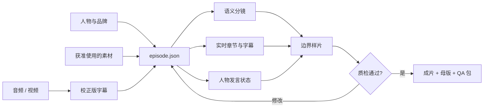

<div align="center">
  

  <h1>Produce Video Podcast</h1>

  <p><strong>把一段声音，编排成一支能经得起逐帧检查的视频播客。</strong></p>
  <p>语义分镜 · 真实时间轴 · 发言者状态 · 素材边界 · 发布级质检</p>

  <p>
    <a href="SKILL.md">查看 Skill</a> ·
    <a href="references/first-run-checklist.md">首次投喂清单</a> ·
    <a href="references/invocation-examples.md">调用范例</a>
  </p>

  <p>
    
    
  </p>
</div>

---

## 它解决的不是“加字幕”，而是整期节目的编排

`produce-video-podcast` 是一个面向 Codex 与兼容 AI Agent 的公共 Skill。它把音频、校正版字幕、人物头像和获准使用的画面素材组织为统一的 `episode.json`，再据此生成单人或多人视频播客，并完成样片、成片与逐帧质检。

| 时间轴可信 | 画面有边界 | 人物会说话 |
|:---|:---|:---|
| 章节节点按真实时间比例移动，尾声不重置 | B-roll 有起止、等级和语境说明，不循环伪装 | 固定席位、真实发言区间、话筒与声波同步 |
| **文字参与叙事** | **证据可复核** | **交付可验收** |
| 字幕、章节、金句和结构图共同推进观点 | 素材来源、用途和边界进入项目数据 | 边界样片、接触表、关键帧和 QA 报告一起交付 |

## 一条数据主线



> 校正版字幕负责“什么时候说”，`episode.json` 负责“此刻画面、人物、文字和素材如何共同表达”。

## 30 秒安装

对 Codex 或其他支持 GitHub Skill 的 Agent 说：

```text
请从 https://github.com/laowu1990lol-bit/produce-video-podcast
安装 produce-video-podcast Skill。
```

也可以手动克隆到 Codex Skills 目录：

```powershell
git clone https://github.com/laowu1990lol-bit/produce-video-podcast.git `
  "$env:USERPROFILE\.codex\skills\produce-video-podcast"
```

## 第一次需要喂给它什么

最少提供：

1. 主音频或主视频；
2. 校正版字幕、带时间文稿，或允许 Skill 转写；
3. 发布平台与画幅；
4. 人物数量、姓名和头像；
5. 可用素材及其授权边界。

品牌色、Logo、栏目名、参考视频、禁用元素和交付命名可以随后补充。完整检查表见 [首次投喂清单](references/first-run-checklist.md)。

## 直接这样调用

```text
请使用 $produce-video-podcast 制作这期节目。

以音频和校正版字幕为唯一时间基准；自动完成语义分镜、章节进度、
字幕与金句、人物发言状态、素材去重和结尾收束。先输出边界样片与
双人交接样片，检查通过后再渲染完整成片。缺少非关键素材时请采用
稳健默认值继续，不要反复询问我。
```

## 核心能力

- **语义分镜**：按观点变化切段，不做机械等时长分幕。
- **实时章节**：进度条、播放头和章节节点全部由真实时间计算。
- **单人 / 双人舞台**：支持 `single` 与固定上下席位的 `dual_stacked`。
- **文字互动**：协调字幕、章节标题、金句、解释卡和结构图的阅读节奏。
- **素材纪律**：检测重复画面；禁止循环、冻结、镜像或反转来伪装复用。
- **证据卡**：记录素材等级、语境、起止和边界说明。
- **样片优先**：先验证章节边界、人物交接和关键布局，再渲染全片。
- **发布级交付**：输出 MP4、母版、`episode.json`、关键帧、接触表与 QA 报告。

## 单一时间轴接口

```json
{
  "duration": 219.26,
  "content_end": 217.26,
  "layout_mode": "dual_stacked",
  "chapters": [],
  "speakers": [],
  "segments": []
}
```

字段定义、约束与示例见 [episode schema](references/episode-schema.md) 和 [示例数据](assets/episode.example.json)。

## 质量底线

- 进度条从 0% 开始，在 `content_end` 达到 100%，尾声保持满格。
- 所有字幕、章节、人物状态与画面边界使用同一时间源。
- 视频不拉伸、不黑帧、不超出源时长，也不留下无意义空窗。
- 发言效果只响应真实说话者区间；不制造虚假的双人同时发言。
- 正式成片前必须完成语法、运行时、布局、动效、对比度与重复素材检查。

## 仓库结构

```text
produce-video-podcast/
├─ SKILL.md                 # Agent 的核心工作协议
├─ agents/openai.yaml       # UI 名称、品牌色与默认调用语
├─ assets/                  # 示例 episode 数据与 Skill 图标
├─ references/              # 首次投喂、布局、QA 与调用说明
└─ scripts/                 # 时间轴校验、素材查重与接触表工具
```

## 品牌与版权

代码与文档采用 [MIT License](LICENSE) 开放使用；“胡子老师”名称、角色形象与仓库品牌视觉保留全部权利，具体边界见 [NOTICE](NOTICE)。

**版权所有 © 2026 胡子老师。** 再发布软件衍生版本时须保留 MIT 版权声明，并建议清楚标注所作修改。

<div align="center">
  <sub>胡子老师出品 · 让时间轴、画面与观点在同一秒发生</sub>
</div>
